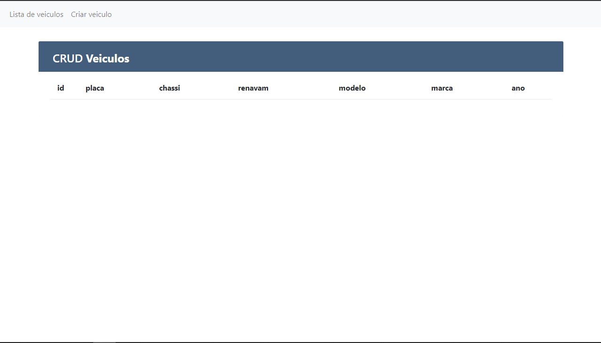
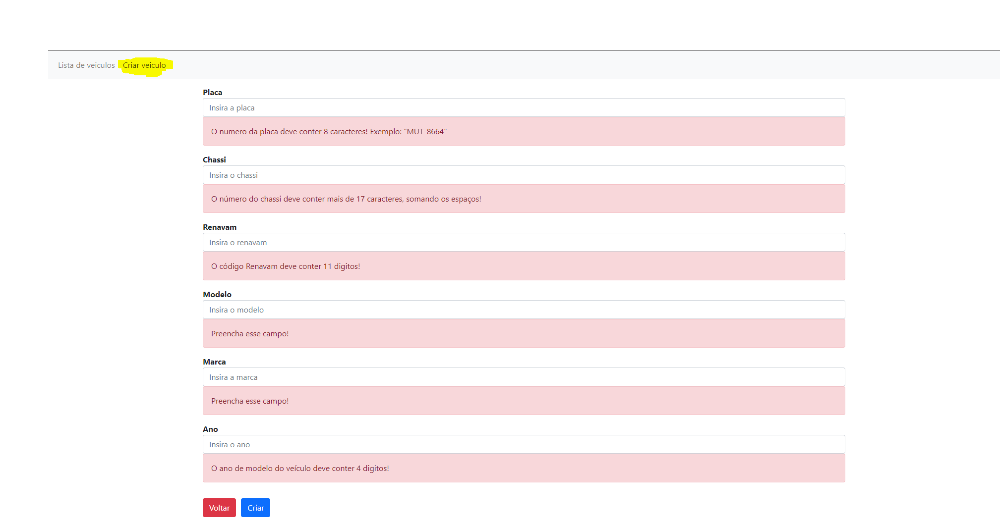

# CRUD VEICULOS

## Tecnologias

#### Aplicação construida utilizando:

- NodeJS;
- Angular;
- Sequelize - ORM utilizado para a comunicação com o banco de dados PostgreSQL;
- Express;
- Bootstrap;
- PostgreSQL - Banco de dados utilizado para armazenamento dos dados;

<br>

## Requisitos

- [Node](https://nodejs.org/pt-br/download/)
- [PostgreSQL](https://www.postgresql.org/download/)
- [Angular-12.1.0](https://angular.io/)

<br>

## Instalações Back-end

#### back-end/api/

```bash
npm install
```

```bash
npx sequelize db:create
```

```bash
npx sequelize db:migrate
```

## Instalações Front-end

#### front-end/

```bash
npm install
```

<br>

# Como rodar a aplicação?

- É necesário rodar o back-end e o front-end separadamente
- O back-end roda na porta 3000
- O front-end roda na porta 4200

<br>

## Execuções Back-end

### Testes Mocha /back-end/api/

```bash
npm test
```

### Rodar API /back-end/api/

```bash
node server.js
```

<br>

## Execuções Front-end

### Rodar Aplicação /front-end/

```bash
ng serve -o
```

<br>

# Funcionamento Inicial

## Listagem vazia

### Inicialmente a aplicação se encontra com a listagem vazia:



### Com isso, é necessário criar os veiculos para obter uma listagem:


